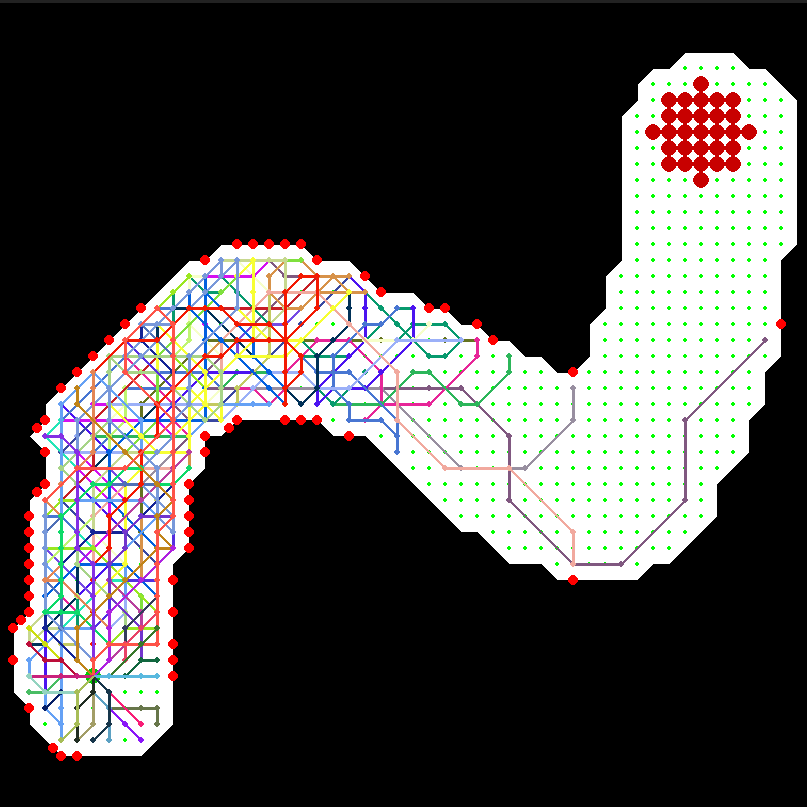
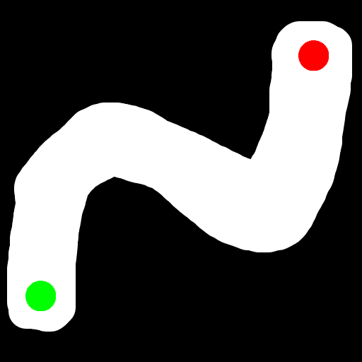
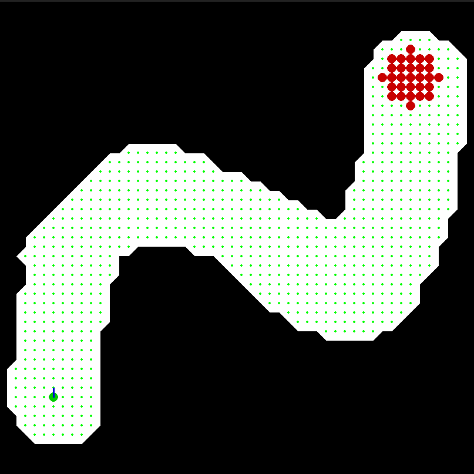

<b style="color: red;">IMPORTANT NOTE: the compiled files in `./cmake-build-debug` must be launched from `carsRaceGameAI` so you need to edit configurations and set their working directory to `../` </b>

# Evolution simulation using a genetic algorithm

This code allow you to train an AI on a 2D car game by using a genetic algorithm

\
*example of 100 individuals trained on this map*

## Game & rules

In this game, let's imagine you are a car, who's position is marked by the last placed point on the map\
You start on a green point representing the starting line\
Your goal is to reach the finish line before your AI opponent does (you need to **be** on a red point of the finish line not just going through it)

Unfortunately for you, the AI has been trained over hundreds of generation to optimize its moves and adapt to different environments, so it might be difficult to do so

The rules are:
- the number of tiles you cross represents your speed (imagine 1 tile = 10km/h)
- you can move in 8 directions (horizontally, vertically, along both diagonal) which correspond to 45° divisions
- you start still (speed=0)
- when your turn come:
    - if you have no speed you can choose any direction to accelerate
    - if you are already moving you can only steer in 3 directions:
        - steer left 45°
        - continue forward
        - steer right 45°
    - together with the steering choice you can influence your speed, which means:
        - accelerating, you will reach 1 tile further (there is an upper speed limit)
        - keeping the same speed, you will travel the same amout of tiles
        - decelerating, you will reach 1 tile closer (if you are at speed 1 you cannot slow down to speed 0)
- crashing in a wall resets your speed to 0, and place you right in front of the impact point 

**The AI follows exactly the same rules a you**
        
## How to design a map

To design a map just open paint or any image editor and put a black background, then trace the track in white

Once you are done, draw a green dot (exactly rgb 0,255,0) for the starting line and a red dot (exactly rgb 255,0,0) for the finish line, make sure to make the dot big enough for the code to see it when scanning the picture to generate the circuit\
(because you can specify a scan resolution, that will affect the number of tile on the map, the lower the resolution the bigger the dots).

Here is a valid example and the map generated out of it (resolution=10)\



To scan your map and generate the 2 text files needed by the code go into `playGame.py`, and for each map edit the line\
`game=carsRace("circuits/pictures/test1.png",x,0.75)`\
where `x` is the scan resolution and run the script

*NOTE: The parameter with value 0.75 here is the windowScaleFactor, it means the game window will take 75% of the screen, it has nothing to do with the map scan* 

## How to train AI

To train the AI you will need to open `main.cpp` and make some changes

First off set the number of individuals per generation by changing `x` in\
`gameTrainer game_trainer=gameTrainer(x);`

Then add as many training circuits as you like by duplicating the line (path to the file that ends with `Points.txt`)\
`game_trainer.addTrainingCircuit("pathToYourCircuitPoints.txt");`

After that specify the number of generation you want the training to last by changing `x` in\
`game_trainer.train(x);`

Finally, compile and run `main.cpp`

It will generate lots of files in the `AI` folder and subsequent folders, those files are:
- `[mapName]-gen[generationIndex].txt`
    - contains each position and crash location of every individual on this map in this generation
    - the first line is the map name (so the visualizer know if you loaded this file for the wrong map)
    - following lines are to read by pairs of 2 (each pair=an individual)
        - line 1 is a list of the positions of the individual separated by `;`
        - line 2 is  a list of segments where the individual crashed into a wall separated by `;` *e.g. 17,19,16,20 means it crashed while moving from tile (17,19) to tile (16,20) which is a wall*

*NOTE: those are matrix coordinates (i,j) representing (line, column)*\
*NOTE 2: the cpp code uses matrix coordinates (i,j) while the python code uses cartesian coordinates (x,y) representing (column, line), origin top left, because it made more sense(to me at least) using those coordinates that represents position in a 2D world* 

- `brains/AI-gen[generationIndex].bigBrain`
    - a file version of the variable `decisionGrid`(6 dimensional C char array) which contains "the brain" of the best individual of this generation
    - this is a way to save and load specific AIs for replay purposes, or to test it on new circuits
    - you can simulate a game on **ANY** map with this file, it is not dependent on the circuits it has been trained on
    - each dimension correspond to a sensor of the AI, all sensors being
        - front left distance to wall
        - front distance to wall
        - front right distance to wall
        - angle to finish line
        - actual speed
        - distance to finish line (manhattan as of now)
    - each elements of this array is a valid decision (following the rules precised earlier) out of those

```c++
#define RIGHT_FIRST_MOVE 0
#define UP_RIGHT_FIRST_MOVE 1
#define UP_FIRST_MOVE 2
#define UP_LEFT_FIRST_MOVE 3
#define LEFT_FIRST_MOVE 4
#define DOWN_LEFT_FIRST_MOVE 5
#define DOWN_FIRST_MOVE 6
#define DOWN_RIGHT_FIRST_MOVE 7

#define GO_LEFT_SLOWER 8
#define GO_FORWARD_SLOWER 9
#define GO_RIGHT_SLOWER 10
#define GO_LEFT_KEEP 11
#define GO_FORWARD_KEEP 12
#define GO_RIGHT_KEEP 13
#define GO_LEFT_FASTER 14
#define GO_FORWARD_FASTER 15
#define GO_RIGHT_FASTER 16
```

## How to Replay Training / Play against AI
Now that you trained the AI, it is time to review the training and its results, open `playGame.py` and scroll down to the bottom of the code, here you can choose which mode you want to use:

- `game.Play("alone")`
    - does not load any AI, just a debug mode
- `game.Play("vsAI","AI/brains/AI-genX.bigBrain")`
    - replace `X` with the index of the last trained generation (or any other) to play against this AI on **ANY** map
- `game.Play("specificAI","AI/brains/AI-genX.bigBrain")`
    - replace `X` with the index of the last trained generation (or any other) to simulate this AI behaviour on **ANY** map
- `game.Play("training")`
    - replay the movements of every individual for each generation
    - automatically loads next generation when the previous finished to replay
    - you can start from a specific generation using the `fromGeneration=x` argument, `x` being the generation you want to start the replay at (usually the first few generations are bad and not worth reviewing)